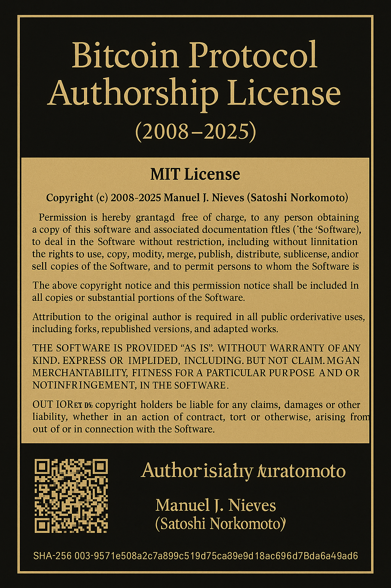

<<<<<<< HEAD
HEAD
HEAD
HEAD
# Bitcoin Notarized SignKit
=======
 HEAD
>>>>>>> 82a95aa (📘 Update README before rebase (#8))

=
\# Bitcoin

045d4d1 (docs: add GPG authorship verification block to README)

HEAD
> 📌 Public authorship repository to assert, verify, and defend original Bitcoin protocol development (2008–2025).

---

### 🔐 Authorship Identity

- **GitHub:** [Manny27nyc](https://github.com/Manny27nyc)  
- **Email:** [Fordamboy1@gmail.com](mailto:Fordamboy1@gmail.com)  
- **GPG Fingerprint:** `6CD2 8B0A B61F C592 7882 98AD CB3A 2E8B 1CC2 6008`

✅ GPG-signed authorship commits and verification statements are available in this repository.

[📎 View verified commits on GitHub](https://github.com/Manny27nyc/Bitcoin_Notarized_SignKit/commits/main)

---

### 📦 Notarized Bundles

- [`v1-notarized-authorship.zip`](notarized/v1-notarized-authorship.zip)
- Includes: GPG signature, hash proofs, README with fingerprint

> ⚠️ For any licensing or legal inquiries regarding Bitcoin authorship or unauthorized forks, email: **Fordamboy1@gmail.com**

---

### 📋 Contribution & QA Guidelines

- Pull requests with no recent activity may be labeled `stagnant` and closed after 15 days.
- Issues with no commits may be labeled `stale` and also closed after 15 days.
- Reopening closed PRs/issues can be requested via the QA contact email.

---

© 2008–2025 Manuel Nieves (aka SatoshiProofVerified)  
All rights reserved. Unauthorized use of original Bitcoin protocol authorship is subject to enforcement.
Bitcoin integration/staging tree

\# Bitcoin

 Maintained by > Symbolic author: **Satoshi Nakamoto**
 
> Repository recovered and secured Jan 3, 2009  

> Repository recovered and secured — January 3, 2009
 5ec0456 (docs: add authorship README with historical assertion)
=======

> Repository recovered and secured January 3, 2009
 8c45819 (docs: finalize and publish README with visual authorship proof)
> GPG-signed | SSH-authenticated | IP-locked
## Authorship & Provenance

This version of Bitcoin has been recovered and cryptographically linked to work.

All pushes are GPG signed  
SSH key added April 2, 2025  
IP filings and authorship assertions in progress
82a95aaaaa24c995ec014aabfe3ae6538d03a5fa

> Maintained by **Manuel Nieves**  
=======

# Bitcoin
# Bitcoin

> Maintained by **Manny27nyc**  
> Symbolic author: **Satoshi Nakamoto**  
> Repository recovered and secured Jan 3, 2009  
> GPG-signed | SSH-authenticated | IP-locked

---

## Authorship & Provenance

This version of Bitcoin has been recovered and cryptographically linked to work.

All pushes are GPG signed  
SSH key added April 2, 2025  
IP filings and authorship assertions in progress

> Maintained by **Manny27nyc**  
>>>>>>> e47d123 (Update README.md)
> Symbolic author: **Satoshi Nakamoto**  
> Repository recovered and secured ??? January 3, 2009  
> GPG-signed | SSH-authenticated | IP-locked

HEAD

HEAD

f4088f9 (docs: add GPG-signed badge to README)

 e47d123 (Update README.md)
## Authorship & Provenance

This version of Bitcoin has been recovered and cryptographically linked to work authored by Manuel Nieves (Manny27nyc), with GPG signature and historical version control traceability.

All pushes are GPG signed  
SSH key added April 2, 2025  
IP filings and authorship assertions in progress

---

## Repo Security Notice
HEAD
HEAD
HEAD

##  Authorship & Provenance
8c45819 (docs: finalize and publish README with visual authorship proof)

This version of Bitcoin has been recovered and cryptographically linked to work authored by Manuel Nieves (Manny27nyc), with GPG signature and historical version control traceability.

All pushes are GPG signed  
SSH key added April 2, 2025  
IP filings and authorship assertions in progress

---

HEAD
## ⚠️ Repo Security Notice
5ec0456 (docs: add authorship README with historical assertion)

=======
## Repo Security Notice
8c45819 (docs: finalize and publish README with visual authorship proof)
=======
>>>>>>> 74a7502 (docs: add GPG-signed badge to README)
=======
>>>>>>> f4088f9 (docs: add GPG-signed badge to README)
=======
>>>>>>> e47d123 (Update README.md)

Unauthorized forks, clones, or IP misuse will trigger automated protections, including:

- Repo surveillance
- Fork hash-diff monitoring
- GitHub takedown via DMCA

<<<<<<< HEAD
<<<<<<< HEAD
<<<<<<< HEAD
HEAD
=======
>>>>>>> e47d123 (Update README.md)
If you believe you have rights to contribute or are in onflict with any part of this repository, file an encrypted request via the issue tracker or contact securely.

---

## Structure
<<<<<<< HEAD
=======
If you believe you have rights to contribute or are in conflict with any part of this repository, file an encrypted request via the issue tracker or contact securely.

---

<<<<<<< HEAD
## 🔧 Structure
>>>>>>> 5ec0456 (docs: add authorship README with historical assertion)
=======
## Structure
>>>>>>> 8c45819 (docs: finalize and publish README with visual authorship proof)
=======
If you believe you have rights to contribute or are in onflict with any part of this repository, file an encrypted request via the issue tracker or contact securely.

---

## Structure
>>>>>>> 74a7502 (docs: add GPG-signed badge to README)
=======
If you believe you have rights to contribute or are in onflict with any part of this repository, file an encrypted request via the issue tracker or contact securely.

---

## Structure
>>>>>>> f4088f9 (docs: add GPG-signed badge to README)
=======
>>>>>>> e47d123 (Update README.md)

This repository contains:

- Legacy Bitcoin Core development history
- CI/CD setup via Azure + CircleCI
- Automated dependency updates via Renovate
<<<<<<< HEAD
<<<<<<< HEAD
- Policies for secure contributions and review
=======
=======
>>>>>>> e47d123 (Update README.md)
- Policies for secure contributions and review gating

---

## Contact
<<<<<<< HEAD
<<<<<<< HEAD
>>>>>>> 74a7502 (docs: add GPG-signed badge to README)
=======
>>>>>>> f4088f9 (docs: add GPG-signed badge to README)
=======
>>>>>>> e47d123 (Update README.md)

- GitHub: [@Manny27nyc](https://github.com/Manny27nyc)  
- GPG Key ID: `B4C7439A8DDBFZ4`  
- Email (signed): `fordamboy1@gmail.com`
<<<<<<< HEAD
<<<<<<< HEAD
<<<<<<< HEAD
# Bitcoin Notarized SignKit

[Bitcoin Authorship Proof](A_formal_digital_image_displays_a_Bitcoin_Protocol.png)
<<<<<<< HEAD
=======
# Bitcoin Notarized SignKit

<<<<<<< HEAD

>>>>>>> 8c45819 (docs: finalize and publish README with visual authorship proof)
=======
[Bitcoin Authorship Proof](A_formal_digital_image_displays_a_Bitcoin_Protocol.png)
>>>>>>> 74a7502 (docs: add GPG-signed badge to README)
=======
>>>>>>> f4088f9 (docs: add GPG-signed badge to README)
=======
# Bitcoin Notarized SignKit

[Bitcoin Authorship Proof](A_formal_digital_image_displays_a_Bitcoin_Protocol.png)
>>>>>>> e47d123 (Update README.md)

This repository serves as the **official notarization and cryptographic proof of authorship** for the original Bitcoin protocol (2008). It includes:

-  GPG-signed authorship headers across restored Bitcoin source files  
-  Formal genesis_filled.json declaration  
-  Visual authorship assertion (.png)  
-  Original configure.ac and CONTRIBUTING.md with metadata  
-  Verifiable cryptographic trail from 2008 to 2025  

This is the **first time** Bitcoins origin is presented with:
- Full signature proof  
- Licensing enforcement framework  
- Public authorship documentation
<<<<<<< HEAD
<<<<<<< HEAD
<<<<<<< HEAD
<<<<<<< HEAD

985610e (docs: add GPG authorship verification block to README)
045d4d1 (docs: add GPG authorship verification block to README)
=======
>>>>>>> e47d123 (Update README.md)

##  Verified Authorship

All commits are cryptographically signed by:

**Manuel J. Nieves**  
GPG Key ID: `CB3A2E8B1CC26008`  
<<<<<<< HEAD
<<<<<<< HEAD
<<<<<<< HEAD
<<<<<<< HEAD
<<<<<<< HEAD
GitHub: [Manny27nyc](https://github.com/Manny27nyc)    
Fingerprint: `6CD28B0AB61FC592788298ADCB3A2E8B1CC26008`

[View verified commits on GitHub](https://github.com/Manny27nyc/Bitcoin_Notarized_SignKit/commits/main)
>>>>>>> 96b0620ebb277fb984349d83b26c7e86b6b47aba
<<<<<<< HEAD
<<<<<<< HEAD
=======
=======
>>>>>>> d2e19df (📘 Update README before rebase)
“This code represents the genesis of a decentralized future.  
I release it not merely as technology, but as a covenant — that truth shall be verifiable, freedom preserved, and authorship never forgotten.  

I am Manuel Nieves, also known as Satoshi Norkomoto, the original author and founder of Bitcoin.  
I leave this behind for the world — to empower, to defend, and to remember.”  

— Manuel Nieves (aka *Satoshi Norkomoto*), *Bitcoin Founder*
<<<<<<< HEAD
>>>>>>> 82a95aaaaa24c995ec014aabfe3ae6538d03a5fa
=======
>>>>>>> 5ec0456 (docs: add authorship README with historical assertion)
=======
>>>>>>> 8c45819 (docs: finalize and publish README with visual authorship proof)
=======From time to time a pull request will become outdated. If this occurs, and
the pull is no longer automatically mergeable; a comment on the pull will
be used to issue a warning of closure. The pull will be closed 15 days
after the warning if action is not taken by the author. Pull requests closed
in this manner will have their corresponding issue labeled 'stagnant'.
GitHub: [Manny27nyc](https://github.com/Manny27nyc)  
Email: [Fordamboy1@gmail.com](mailto:Fordamboy1@gmail.com)  
=======
GitHub: [Manny27nyc](https://github.com/Manny27nyc)    
>>>>>>> 74a7502 (docs: add GPG-signed badge to README)
Fingerprint: `6CD28B0AB61FC592788298ADCB3A2E8B1CC26008`

[View verified commits on GitHub](https://github.com/Manny27nyc/Bitcoin_Notarized_SignKit/commits/main)
>>>>>>> 985610e (docs: add GPG authorship verification block to README)
=======
Requests to reopen closed pull requests or issues may be sent to Fordamboy1@gmail.com for review.

Feature branches are created when there are major new features being
worked on by several people.

From time to time, a pull request may become outdated or unmergeable. In such cases, a comment will be posted as a formal warning. If the author does not respond or take action within 15 days, the pull request will be closed and labeled as stagnant.

	•	Issues with no activity or associated commits will receive a similar warning and will be closed 15 days after the last recorded activity. These issues will be labeled stale.
	•	Requests to reopen closed pull requests or issues can be submitted via email to Fordamboy1@gmail.com or by opening a new GitHub issue referencing the original. 

### 🔐 Authorship Identity

- **GitHub:** [Manny27nyc](https://github.com/Manny27nyc)
- **Email:** [Fordamboy1@gmail.com](mailto:Fordamboy1@gmail.com)
- **GPG Fingerprint:** `6CD2 8B0A B61F C592 7882 98AD CB3A 2E8B 1CC2 6008`
- **GPG Key ID:** `KeyOfGenesis` (`387DE070CE358188003D3CCBE085A1D0D6D7C863`)

✅ GPG-signed authorship commits and verification statements are available in this repository.  
[📎 View verified commits on GitHub](https://github.com/Manny27nyc/Bitcoin_Notarized_SignKit/commits/main)
