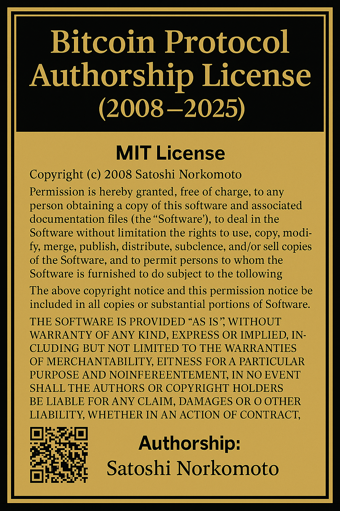

## 📁 Licensing Enforcement Records (2025)

### Kraken Licensing Violation — June 30, 2025
- 📄 [Notice PDF (IPFS)](https://ipfs.io/ipfs/QmdZCEMBR6BVQDPV367jRuGxKy1AkEmrYvLyB84e4hVApc)
- 🔏 [GPG Signature](https://ipfs.io/ipfs/QmaiiCt2oUdkPMp2nuwBkQsVEiRrzYy6QqUGhXoJmxYHrh)
- 📦 [Full Enforcement Bundle (ZIP)](https://ipfs.io/ipfs/Qmau99LwZLWcgoaeE8ipvt6Pqix264D17UrztYp76kmkYE)
- 💰 Estimated Royalties: **$530,000**

> 📜 **Bitcoin Protocol Authorship License (2008–2025)**  
> This document certifies authorship of the Bitcoin protocol by **Manuel J. Nieves** (Satoshi Norkomoto).  
> GPG-signed. Timestamped. Enforced under [17 U.S. Code § 102](https://www.law.cornell.edu/uscode/text/17/102) and [§ 1201](https://www.law.cornell.edu/uscode/text/17/1201).

---
**Notice**: All forks, modifications, or commercial uses of this protocol **must obtain a license**.  
See `SIGN_FINAL.md` and `notarized_bundle_v1.zip.asc` for authorship proof and verification.
